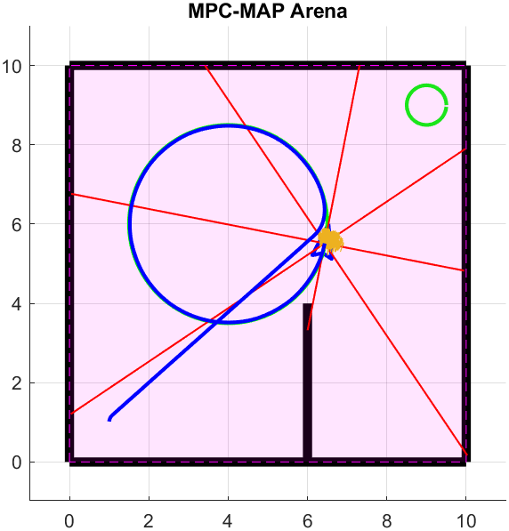

**Author:**        Alikhan Nurkhat (242251)
**Date:**            13.04.2026

#### Task 1 - Prediction
In this task, individual left and right wheel velocities were converted into linear and angular velocities using a differential drive model, incorporating random motion noise with a normal distribution. The noise magnitude is passed as a function argument and is defined in `public_vars` as `motion_noise`. Based on this motion vector and the sampling period, the next position is calculated. 
#### Task 2 - Correction
In this task, distances from each particle to the nearest wall intersections were calculated, accounting for the orientation of the lidar beams relative to the robot. The second part of the task involves calculating the likelihood weights for each particle by comparing these hypothetical distances with the robot's actual measurements; a smaller error between the measurement and the hypothesis results in a higher weight. To avoid numerical underflow (rounding to zero), a logarithmic approach was implemented by summing the errors of each individual beam. This function utilizes a critical parameter defined in `public_vars` as `sensor_noise`.
#### Task 3 - Resampling
The `resample_particles` function was implemented to maintain the stability of the filter by replacing low-weight particles with copies of high-weight ones. A **systematic resampling** algorithm was chosen, which utilizes the cumulative distribution function (CDF) of the weights and a "comb-like" selection method with a constant step size. By selecting a random starting point (`current_tooth`) and iterating through the CDF with a fixed step, the algorithm efficiently generates a new set of particles concentrated around the most probable states.
#### Task 4 – Localization
In this task, the filter was initialized by generating a set of particles with random positions and orientations distributed uniformly across the map. The `estimate_pose` function was implemented to calculate the mean state of all particles, serving as the primary localization source for trajectory following in place of Mocap data.

System performance was optimized by tuning three key parameters: `sensor_noise`, `motion_noise`, `particles_count`. The entire configuration of these parameters is managed within the `student_workspace.m` file through the `public_vars` structure.

The primary challenge involved debugging "particle collapse," where the filter would condense into a single point prematurely. While the estimated position was generally accurate, the filter occasionally converged to incorrect, distant regions of the map. This was resolved by significantly increasing `sensor_noise`, which maintained particle diversity and provided the stability necessary for reliable estimation. This adjustment also allowed for a lower `particles_count`, reducing computational complexity. Finally, experiments with `motion_noise` demonstrated that while lower values decreased the root-mean-square error (RMSE) between the actual and desired trajectories, a balanced value was essential for maintaining filter robustness during maneuvers.

 

