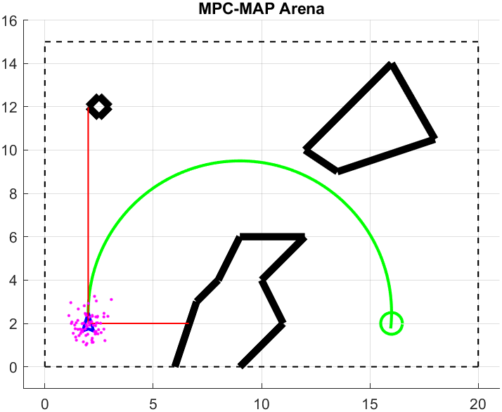
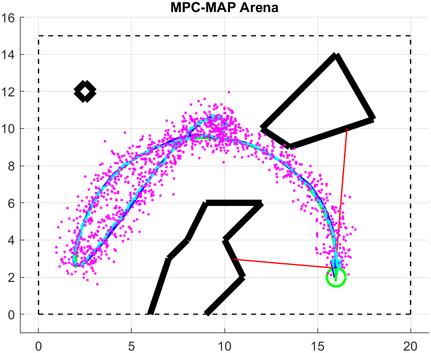

**Author:**         Alikhan Nurkhat (242251)

**Date:**           20.04.2026

#### Task 1 - Preparation

  

The robot remains stationary for 100 samples to collect GNSS data and pre-calculate the trajectory. At sample 101, init_kalman_filter determines the initial mean pose and measurement covariance matrix from the history. Following initialization, the EKF begins continuous pose estimation and trajectory following. In *student_workpsace.m* redundant components, such as the particle filter, path planing were removed for clarity.

#### Task 2 - EKF implementation
A non-linear EKF prediction step was implemented using a differential drive kinematics model and Jacobian-based linearization ($G$). The correction phase utilizes a linear Kalman Filter, as the GNSS measurement directly relates to the state variables ($x, y$) via the observation matrix $C$.

#### Task 3 - Filter tuning with a known initial pose

 

The EKF was initialized with the true pose x=[2,2,π/2] and zero initial covariance (see init_kalman_filter.m). The filter was tuned by balancing odometry smoothness and GNSS feedback. While the measurement noise $Q$ was derived from stationary GNSS analysis, the process noise $R$ was iteratively adjusted. The final optimal performance was achieved with:

`R = diag([3e-5, 3e-5, 3e-5])`

#### Task 4 – Algorithm deployment

  

The initialization procedure from Task 1 was utilized to estimate the initial belief. Since orientation cannot be measured directly, a high initial variance was assigned to this variable. Through motion, the estimated pose successfully converged to the true values, demonstrating the EKF's capability to estimate hidden states. To verify the algorithm's robustness, the initial robot pose was modified in setup.m; in all cases, the EKF successfully recovered, and the robot returned to the designated trajectory.