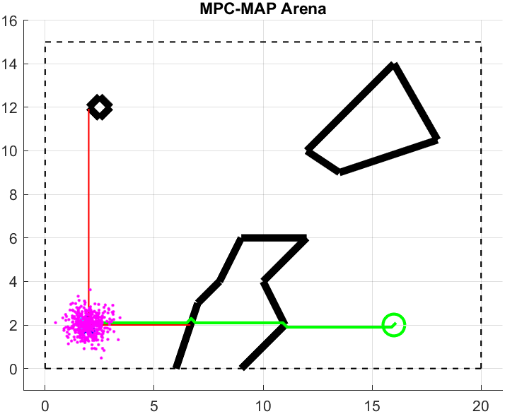
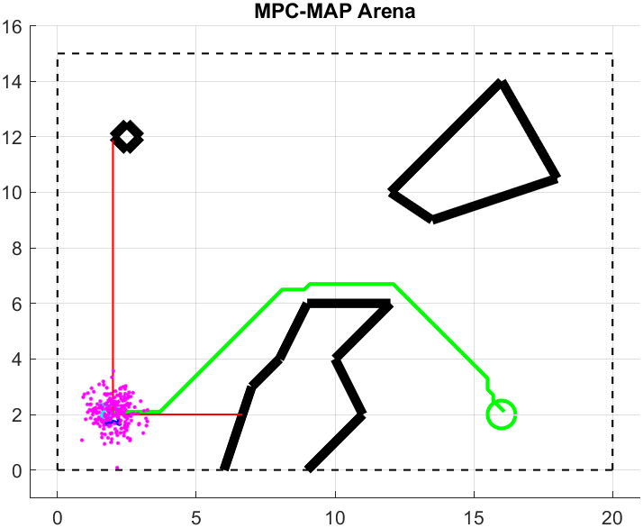
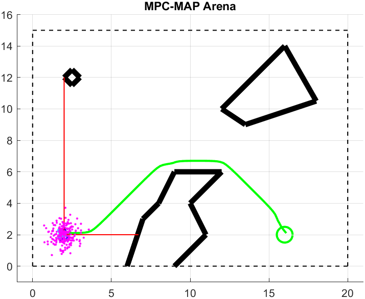

**Author:**         Alikhan Nurkhat (242251)

**Date:**           27.04.2026

#### Task 1

  

I implemented the A-star algorithm, which is an informed search method. It was chosen because it ensures optimality (finding the shortest path) and completeness (finding a solution if it exists). I used the Euclidean distance as the heuristic function. The implementation successfully finds the optimal path in the provided environment. At this stage, the planner treats the robot as a point robot with zero radius, searching for the shortest path strictly through free grid cells. Since the algorithm does not account for the physical dimensions of the platform, the resulting trajectory runs immediately adjacent to obstacle boundaries or intersects them at corners, which would lead to collisions in a real-world scenario.

#### Task 2

  

I applied a morphological dilation operation to the occupancy grid using a circular structuring element with a radius of 1.5 * wheel_base for extra safety at high velocity. This process effectively inflates the obstacles, ensuring that even if the point-robot path touches the new boundary, the physical robot maintains the required clearance. The call to the dilate_map function is made directly inside the astar function during the initialization phase.

#### Task 3 

 

 I implemented the Iterative Gradient Descent smoother. The algorithm optimizes the position of path nodes by balancing two competing forces: Data weight, which keeps the path close to the original A* result, and Smoothness weight, which minimizes the curvature. These parameters were configured in student_workspace.m 
 Through testing, I found that data weight = 0.25 and smoothness weight = 0.5 provide a good balance for this environment.

#### Note
Due to the focus on path planning, localization was implemented using a Kalman Filter and GNSS, making the solution specific to the outdoor_1.txt map. LiDAR and Particle Filter integration were omitted. During the first 100 stationary samples, the robot gathers GNSS statistics. On sample 101, the system initializes the filter, estimates the starting pose, and computes the path to the goal. From that point onward, the robot follows the generated trajectory while iteratively updating its position.